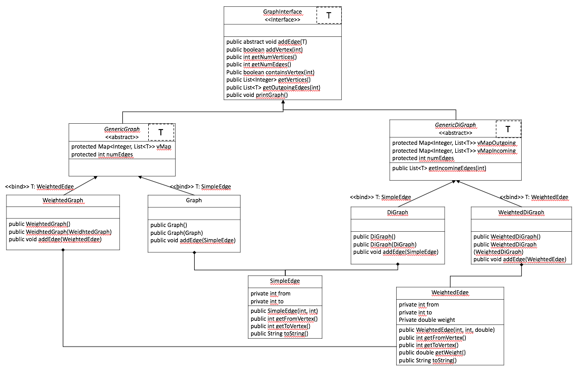
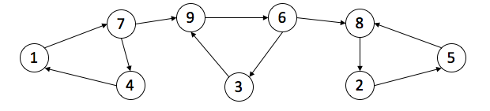

# graphs-galore

## Graph Representation

The overall structure of the representation of a graph is shown here. GraphInterface is an interface that uses a generic type T. GenericGraph and GenericDiGraph both implement the GraphInterface interface. GenericGraph is defined as an undirected graph and GenericDiGraph is defined as a directed graph. Both of these classes also use the generic type T. Graph and WeightedGraph classes both extend GenericGraph and then DiGraph and WeightedDiGraph classes both extend GenericDiGraph. SimpleEdge and WeightedEdge are two edge classes that are used for unweighted and weighted type graphs respectively.



## Implementation

Implementations of the following graph algorithms are included:

- Breadth First Search
- Strongly Connected Components
- Minimum Spanning Tree

## Input Graphs

Refer to input_directed_unweighted.txt for an input file that represents a graph. First line of an input file must indicate if the graph is directed or undirected. The rest of the lines correspond to either unconnected vertices or edges. For an unweighted graph, each edge is composed of 2 integer vertices. For a weighted graph, each edge is composed of 2 integer vertices and then the weight corresponding to that edge. A visual representation of the graph in input_directed_unweighted.txt is shown here.



## Assumptions

- Vertices are labeled as unique integers.
- Weights are assumed to be of type double.
- Vertices and edges can be added but not removed.

# Breadth First Search

This algorithm takes in a graph, a source vertex, a destination vertex and returns the shortest path from the source to the destination. This will function for either undirected or directed graphs as long as the graph is unweighted.

## Usage

The first argument is the file name corresponding to the desired graph. The second argument is an integer source vertex. The third argument is the integer destination vertex.
```
$ javac *.java
$ java BreadthFirstSearch input_directed_unweighted.txt 4 5
```

This will write to output.txt the shortest path desired:
4, 1, 7, 9, 6, 8, 2, 5,

If this graph was indicated as undirected, the following shortest path should be expected:
4, 7, 9, 6, 8, 5, 

If a path from source to destination does not exist, output.txt is not created or overwritten.

# Strongly Connected Componenets

This algorithm takes in a directed unweighted graph and returns a list of the strongly connected componenets.

## Usage

The only argument is the file name corresponding the the desired graph.
```
$ javac *.java
$ java StronglyConnectedComponents input_directed_unweighted.txt
```
This will write to output.txt the graph's strongly connected componenets (1 scc per line):

1, 4, 7, 

2, 5, 8, 

3, 6, 9, 

# Minimum Spanning Tree

Two versions of Prim's minimum spaning tree (MST) algorithms are included. PrimMST.java solves for the MST naively in O(mn) run time and FastPrimMST.java solves for the MST using heaps in O(mlogn) run time where m is the number of edges and n is the number of vertices in the graph. These algorithms takes in a connected undirected and weighted graph and returns the overall cost of the MST found and the edges in the MST. The edge weights of the graph are general and can be negative or non-negative.

## Usage

The only argument is the file name corresponding to the desired graph.
```
$ javac *.java
$ java PrimMST input_undirected_weighted.txt
```
The fast version of Prim's algorithm is used in the same manner.
```
$ javac *.java
$ java FastPrimMST input_undirected_weighted.txt
```
Both calls will create an output.txt in which the first line denotes the overall cost of the MST found and the rest of the lines denote the edges in the MST.
